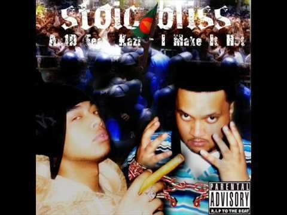

# 🎤 Stoic Bliss

[](#) [](#) [](#)

<p align="center">
  
</p>

## 🌟 About the Band

> **Stoic Bliss** is a pioneering Bangladeshi-American hip-hop and urban group formed in Queens, New York, in 2004. Widely recognized as the revolutionary pioneers who introduced mainstream hip-hop, rap, and urban street culture to Bangladesh, they blended authentic East Coast hip-hop production with sharp, unapologetic Bengali lyricism and slang. Founded by visionary artists Kazi Rahman and Ac1D alongside core collaborators Xtro, B1shop, Tizzy Montana, Rul, Fly, and Mana, Stoic Bliss created a monumental cultural phenomenon with their legendary breakout single *"Abar Jigay"*. Their groundbreaking debut album *Light Years Ahead* (2006) sold over 250,000 copies, permanently redefining the landscape of contemporary Bangladeshi music.

---

## 📑 Discography Index

1. [Light Years Ahead (আলোক বর্ষ দূরে) (2006)](#1-light)
2. [Kolponar Baire (কল্পনার বাইরে) (2007)](#2-kolponar)

---

<a id="1-light"></a>
## 1. Light Years Ahead (আলোক বর্ষ দূরে) (2006)

- **Band:** Stoic Bliss
- **Release Year:** 2006
- **Record Label:** G-Series
- **Audio Quality:** Lossless WAV (16-bit / 44.1 kHz)

<p align="center">
  
</p>

### 📖 About the Album
Released in June 2006 under the legendary label G-Series, *Light Years Ahead* (also titled *Alok Borsho Durey*) is the monumental debut studio album by Stoic Bliss that launched the Bangla rap revolution. Selling over 250,000 copies in its first 10 months, it remains one of the best-selling and most culturally influential albums in Bangladeshi music history. Fueled by the colossal breakout single *"Abar Jigay"*—which instantly became a nationwide catchphrase—the album features an electrifying lineup of party bangers, emotional storytelling, and rap ballads including *"Mayabi Chokh"*, *"Party at PianoHouse"*, *"Sheshbarer Moto"*, and *"Chow Mei Fun"*.

### 🎵 Tracklist (One-Tap Download)

- [**01 Intro**](https://media.githubusercontent.com/media/GhostDog45/Stoic-Bliss/master/Light%20Years%20Ahead/01%20Intro.wav?download=true) &nbsp; [](https://media.githubusercontent.com/media/GhostDog45/Stoic-Bliss/master/Light%20Years%20Ahead/01%20Intro.wav?download=true)
- [**02 Abar Jigay**](https://media.githubusercontent.com/media/GhostDog45/Stoic-Bliss/master/Light%20Years%20Ahead/02%20Abar%20Jigay.wav?download=true) &nbsp; [](https://media.githubusercontent.com/media/GhostDog45/Stoic-Bliss/master/Light%20Years%20Ahead/02%20Abar%20Jigay.wav?download=true)
- [**03 Party At Pianohouse**](https://media.githubusercontent.com/media/GhostDog45/Stoic-Bliss/master/Light%20Years%20Ahead/03%20Party%20At%20Pianohouse.wav?download=true) &nbsp; [](https://media.githubusercontent.com/media/GhostDog45/Stoic-Bliss/master/Light%20Years%20Ahead/03%20Party%20At%20Pianohouse.wav?download=true)
- [**04 Chow Mei Fun**](https://media.githubusercontent.com/media/GhostDog45/Stoic-Bliss/master/Light%20Years%20Ahead/04%20Chow%20Mei%20Fun.wav?download=true) &nbsp; [](https://media.githubusercontent.com/media/GhostDog45/Stoic-Bliss/master/Light%20Years%20Ahead/04%20Chow%20Mei%20Fun.wav?download=true)
- [**05 Prem... Mrittur Por**](https://media.githubusercontent.com/media/GhostDog45/Stoic-Bliss/master/Light%20Years%20Ahead/05%20Prem...%20Mrittur%20Por.wav?download=true) &nbsp; [](https://media.githubusercontent.com/media/GhostDog45/Stoic-Bliss/master/Light%20Years%20Ahead/05%20Prem...%20Mrittur%20Por.wav?download=true)
- [**06 Mayabi Chokh**](https://media.githubusercontent.com/media/GhostDog45/Stoic-Bliss/master/Light%20Years%20Ahead/06%20Mayabi%20Chokh.wav?download=true) &nbsp; [](https://media.githubusercontent.com/media/GhostDog45/Stoic-Bliss/master/Light%20Years%20Ahead/06%20Mayabi%20Chokh.wav?download=true)
- [**07 Sheshbarer Moto**](https://media.githubusercontent.com/media/GhostDog45/Stoic-Bliss/master/Light%20Years%20Ahead/07%20Sheshbarer%20Moto.wav?download=true) &nbsp; [](https://media.githubusercontent.com/media/GhostDog45/Stoic-Bliss/master/Light%20Years%20Ahead/07%20Sheshbarer%20Moto.wav?download=true)
- [**08 Badman Returns**](https://media.githubusercontent.com/media/GhostDog45/Stoic-Bliss/master/Light%20Years%20Ahead/08%20Badman%20Returns.wav?download=true) &nbsp; [](https://media.githubusercontent.com/media/GhostDog45/Stoic-Bliss/master/Light%20Years%20Ahead/08%20Badman%20Returns.wav?download=true)
- [**09 Bangladesh**](https://media.githubusercontent.com/media/GhostDog45/Stoic-Bliss/master/Light%20Years%20Ahead/09%20Bangladesh.wav?download=true) &nbsp; [](https://media.githubusercontent.com/media/GhostDog45/Stoic-Bliss/master/Light%20Years%20Ahead/09%20Bangladesh.wav?download=true)
- [**10 The Epitome**](https://media.githubusercontent.com/media/GhostDog45/Stoic-Bliss/master/Light%20Years%20Ahead/10%20The%20Epitome.wav?download=true) &nbsp; [](https://media.githubusercontent.com/media/GhostDog45/Stoic-Bliss/master/Light%20Years%20Ahead/10%20The%20Epitome.wav?download=true)
- [**11 Roktim Shinghashon**](https://media.githubusercontent.com/media/GhostDog45/Stoic-Bliss/master/Light%20Years%20Ahead/11%20Roktim%20Shinghashon.wav?download=true) &nbsp; [](https://media.githubusercontent.com/media/GhostDog45/Stoic-Bliss/master/Light%20Years%20Ahead/11%20Roktim%20Shinghashon.wav?download=true)
- [**12 Deceptive Measures**](https://media.githubusercontent.com/media/GhostDog45/Stoic-Bliss/master/Light%20Years%20Ahead/12%20Deceptive%20Measures.wav?download=true) &nbsp; [](https://media.githubusercontent.com/media/GhostDog45/Stoic-Bliss/master/Light%20Years%20Ahead/12%20Deceptive%20Measures.wav?download=true)
- [**13 Ato Raag-**](https://media.githubusercontent.com/media/GhostDog45/Stoic-Bliss/master/Light%20Years%20Ahead/13%20Ato%20Raag-.wav?download=true) &nbsp; [](https://media.githubusercontent.com/media/GhostDog45/Stoic-Bliss/master/Light%20Years%20Ahead/13%20Ato%20Raag-.wav?download=true)
- [**14 Bloopers**](https://media.githubusercontent.com/media/GhostDog45/Stoic-Bliss/master/Light%20Years%20Ahead/14%20Bloopers.wav?download=true) &nbsp; [](https://media.githubusercontent.com/media/GhostDog45/Stoic-Bliss/master/Light%20Years%20Ahead/14%20Bloopers.wav?download=true)

### 🖼️ Album Artwork

| | |
| :---: | :---: |
| <br><sub><b>1. Front Cover</b></sub> | <br><sub><b>2. Front Cover (Alternative Scan)</b></sub> |
| <br><sub><b>3. Tray Inlay Artwork</b></sub> | <br><sub><b>4. Compact Disc (CD)</b></sub> |
| <br><sub><b>5. Light Years Ahead [Cassette Sleeve-1]</b></sub> | <br><sub><b>6. Light Years Ahead [Cassette Sleeve-2]</b></sub> |
| <br><sub><b>7. cover</b></sub> |  |

---

<a id="2-kolponar"></a>
## 2. Kolponar Baire (কল্পনার বাইরে) (2007)

- **Band:** Stoic Bliss
- **Release Year:** 2007
- **Record Label:** G-Series
- **Audio Quality:** High Quality 320 kbps MP3

<p align="center">
  
</p>

### 📖 About the Album
Released in 2007 as the direct follow-up to their historic debut, *Kolponar Baire* ("Beyond Imagination") is the anticipated sophomore studio album by Stoic Bliss. Expanding their signature Queens-meets-Dhaka style, the record showcases an evolved sonic palette blending hardcore hip-hop verses, urban beats, and infectious melodic hooks. Standout anthems include *"Acid Ke?"*, the popular hit sequel *"Abar Abar Jigay"*, the witty tongue-twister *"Pakhi Paka Pepe Khay"*, and the nocturnal classic *"Raatri Jaga"*.

### 🎵 Tracklist (One-Tap Download)

- [**Abar Abar Jigay**](https://media.githubusercontent.com/media/GhostDog45/Stoic-Bliss/master/STOIC%20BLISS%20-%20KOLPONAR%20BAIRE/Abar%20Abar%20Jigay.mp3?download=true) &nbsp; [](https://media.githubusercontent.com/media/GhostDog45/Stoic-Bliss/master/STOIC%20BLISS%20-%20KOLPONAR%20BAIRE/Abar%20Abar%20Jigay.mp3?download=true)
- [**Acid Ke**](https://media.githubusercontent.com/media/GhostDog45/Stoic-Bliss/master/STOIC%20BLISS%20-%20KOLPONAR%20BAIRE/Acid%20Ke.mp3?download=true) &nbsp; [](https://media.githubusercontent.com/media/GhostDog45/Stoic-Bliss/master/STOIC%20BLISS%20-%20KOLPONAR%20BAIRE/Acid%20Ke.mp3?download=true)
- [**Amar Bondhu Bonduk**](https://media.githubusercontent.com/media/GhostDog45/Stoic-Bliss/master/STOIC%20BLISS%20-%20KOLPONAR%20BAIRE/Amar%20Bondhu%20Bonduk.mp3?download=true) &nbsp; [](https://media.githubusercontent.com/media/GhostDog45/Stoic-Bliss/master/STOIC%20BLISS%20-%20KOLPONAR%20BAIRE/Amar%20Bondhu%20Bonduk.mp3?download=true)
- [**Berajaal**](https://media.githubusercontent.com/media/GhostDog45/Stoic-Bliss/master/STOIC%20BLISS%20-%20KOLPONAR%20BAIRE/Berajaal.mp3?download=true) &nbsp; [](https://media.githubusercontent.com/media/GhostDog45/Stoic-Bliss/master/STOIC%20BLISS%20-%20KOLPONAR%20BAIRE/Berajaal.mp3?download=true)
- [**Ei Je Ami**](https://media.githubusercontent.com/media/GhostDog45/Stoic-Bliss/master/STOIC%20BLISS%20-%20KOLPONAR%20BAIRE/Ei%20Je%20Ami.mp3?download=true) &nbsp; [](https://media.githubusercontent.com/media/GhostDog45/Stoic-Bliss/master/STOIC%20BLISS%20-%20KOLPONAR%20BAIRE/Ei%20Je%20Ami.mp3?download=true)
- [**FIRE LIKE A DRAGON**](https://media.githubusercontent.com/media/GhostDog45/Stoic-Bliss/master/STOIC%20BLISS%20-%20KOLPONAR%20BAIRE/FIRE%20LIKE%20A%20DRAGON.mp3?download=true) &nbsp; [](https://media.githubusercontent.com/media/GhostDog45/Stoic-Bliss/master/STOIC%20BLISS%20-%20KOLPONAR%20BAIRE/FIRE%20LIKE%20A%20DRAGON.mp3?download=true)
- [**Intro**](https://media.githubusercontent.com/media/GhostDog45/Stoic-Bliss/master/STOIC%20BLISS%20-%20KOLPONAR%20BAIRE/Intro.mp3?download=true) &nbsp; [](https://media.githubusercontent.com/media/GhostDog45/Stoic-Bliss/master/STOIC%20BLISS%20-%20KOLPONAR%20BAIRE/Intro.mp3?download=true)
- [**Pakhi Paka Pepe Khay**](https://media.githubusercontent.com/media/GhostDog45/Stoic-Bliss/master/STOIC%20BLISS%20-%20KOLPONAR%20BAIRE/Pakhi%20Paka%20Pepe%20Khay.mp3?download=true) &nbsp; [](https://media.githubusercontent.com/media/GhostDog45/Stoic-Bliss/master/STOIC%20BLISS%20-%20KOLPONAR%20BAIRE/Pakhi%20Paka%20Pepe%20Khay.mp3?download=true)
- [**Pura Ura Dhura**](https://media.githubusercontent.com/media/GhostDog45/Stoic-Bliss/master/STOIC%20BLISS%20-%20KOLPONAR%20BAIRE/Pura%20Ura%20Dhura.mp3?download=true) &nbsp; [](https://media.githubusercontent.com/media/GhostDog45/Stoic-Bliss/master/STOIC%20BLISS%20-%20KOLPONAR%20BAIRE/Pura%20Ura%20Dhura.mp3?download=true)
- [**Raatri Jaga**](https://media.githubusercontent.com/media/GhostDog45/Stoic-Bliss/master/STOIC%20BLISS%20-%20KOLPONAR%20BAIRE/Raatri%20Jaga.mp3?download=true) &nbsp; [](https://media.githubusercontent.com/media/GhostDog45/Stoic-Bliss/master/STOIC%20BLISS%20-%20KOLPONAR%20BAIRE/Raatri%20Jaga.mp3?download=true)
- [**Sample This**](https://media.githubusercontent.com/media/GhostDog45/Stoic-Bliss/master/STOIC%20BLISS%20-%20KOLPONAR%20BAIRE/Sample%20This.mp3?download=true) &nbsp; [](https://media.githubusercontent.com/media/GhostDog45/Stoic-Bliss/master/STOIC%20BLISS%20-%20KOLPONAR%20BAIRE/Sample%20This.mp3?download=true)
- [**Shapura**](https://media.githubusercontent.com/media/GhostDog45/Stoic-Bliss/master/STOIC%20BLISS%20-%20KOLPONAR%20BAIRE/Shapura.mp3?download=true) &nbsp; [](https://media.githubusercontent.com/media/GhostDog45/Stoic-Bliss/master/STOIC%20BLISS%20-%20KOLPONAR%20BAIRE/Shapura.mp3?download=true)
- [**Somoyer Palki**](https://media.githubusercontent.com/media/GhostDog45/Stoic-Bliss/master/STOIC%20BLISS%20-%20KOLPONAR%20BAIRE/Somoyer%20Palki.mp3?download=true) &nbsp; [](https://media.githubusercontent.com/media/GhostDog45/Stoic-Bliss/master/STOIC%20BLISS%20-%20KOLPONAR%20BAIRE/Somoyer%20Palki.mp3?download=true)

### 🖼️ Album Artwork

| | |
| :---: | :---: |
| <br><sub><b>1. Front Cover Artwork</b></sub> | <br><sub><b>2. Collector's Poster</b></sub> |
| <br><sub><b>3. Inside Inlay (Front)</b></sub> | <br><sub><b>4. Compact Disc (CD)</b></sub> |
| <br><sub><b>5. Tray Inlay (Back)</b></sub> | <br><sub><b>6. Full Case Wrap (Front & Back)</b></sub> |

---

### 💾 Git LFS & Downloading Audio
All audio tracks in this repository are managed via **Git LFS** (Large File Storage).
- **One-Tap Direct Download:** Click either the track title or the green `Download` button next to any song to instantly save the audio file to your device.
- **To clone the complete discography locally with all audio files:**
  ```bash
  git lfs install
  git clone https://github.com/GhostDog45/Stoic-Bliss.git
  ```
---

### 🙏 Special Thanks & Gratitude
Heartfelt gratitude to **Shohail Ibne Mahbub (XTR)** for his monumental passion and dedication in keeping Bangladeshi band music alive. Through his archival project [**Bangla CD Covers**](https://banglacdcovers.blogspot.com/), he has painstakingly collected, preserved, and scanned original physical CDs and cassette tapes, ensuring that the legacy, artwork, and history of Bangladesh's rock and band movement remain preserved for generations of music lovers.
